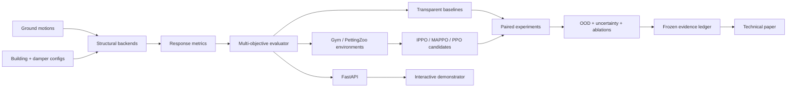

<p align="center">
  
</p>

<h1 align="center">SeismicShield-RL</h1>
<p align="center"><strong>Paper-grade multi-agent reinforcement learning benchmark for seismic damper co-design</strong></p>
<p align="center">
  
  
  
  
</p>

> **Scientific status — v0.1.0:** the repository contains a deterministic research surrogate, benchmark harness, reproducibility contract, interfaces for OpenSeesPy and multi-agent RL, a REST API, tests, Docker and CI. It does **not** yet make paper-level claims about seismic protection performance. Smoke-benchmark outputs are software-validation artifacts only.


## Open-science commitment

The project now uses an explicit preregistration-first confirmatory workflow. The existing v0.1 synthetic smoke benchmark is disclosed as prior exploratory software validation. Primary confirmatory claims are programmatically blocked until a public OSF preregistration DOI is recorded. See [`open_science/OSF_PREREGISTRATION_DRAFT.md`](open_science/OSF_PREREGISTRATION_DRAFT.md), [`SIMULATOR_STACK.md`](SIMULATOR_STACK.md) and [`BENCHMARK_SPEC.md`](BENCHMARK_SPEC.md).

Planned persistent identifiers are deliberately separated by scholarly object: OSF DOI for the preregistered protocol, Zenodo concept/version DOI for frozen software and evidence, and engrXiv DOI for the manuscript.

## Research question

Can a multi-agent reinforcement-learning co-design policy jointly optimize the **number**, **inter-story distribution**, and **slip-force parameters** of friction dampers in multi-story buildings while producing a better out-of-sample Pareto trade-off among **retrofit cost**, **maximum inter-story drift ratio (MIDR)**, and **peak floor acceleration (PFA)** than transparent heuristic, evolutionary, and single-agent RL baselines under unseen earthquake records and structural uncertainty?

## Why this repository exists

Seismic-control RL papers are often difficult to compare because the structural model, earthquake split, reward normalization, optimizer budget, seeds, and evaluation protocol vary together. SeismicShield-RL is designed as a **benchmark first and a model second**: every algorithm must solve the same frozen tasks, on the same earthquake worlds, with the same compute budget and the same reporting contract.

The project is organized around two tracks:

- **Track A — Core research:** structural dynamics, OpenSees parity, benchmark tasks, baselines, MARL algorithms, experiments, ablations, uncertainty, frozen evidence and manuscript claims.
- **Track B — Research demonstrator:** interactive simulator, scenario explorer, REST API and GitHub Pages. Demonstrator outputs are never the source of primary paper claims.

## Primary benchmark tasks

### Task A — Offline structural co-design (primary paper)
One episode represents one retrofit design. Each story is an agent. Agents simultaneously choose damper count and slip-force level. A shared global objective evaluates cost, MIDR and PFA over a frozen suite of ground motions. This formulation tests decentralized design decisions with centralized training/evaluation.

### Task B — Adaptive semi-active control (extension)
At each structural time step, story-level agents adjust admissible slip-force commands. This task will be added only after the passive/offline benchmark and OpenSees backend pass parity tests, so design optimization and real-time control are not conflated.

## What is already implemented in v0.1.0

- deterministic N-story shear-building research surrogate
- smooth Coulomb-style story damper model for fast algorithm development
- MIDR, PFA and dissipated-energy metrics
- explicit damper-count/capacity cost model
- no-damper, uniform, drift-proportional and random-search baselines
- one-shot single-agent Gymnasium-compatible design environment (optional dependency)
- PettingZoo Parallel multi-agent design environment (optional dependency)
- OpenSees backend contract with an intentionally gated validation status
- reproducible synthetic ground-motion fixture
- paired benchmark runner with CSV/JSON artifacts and SHA-256 manifest
- FastAPI endpoints for simulation and benchmark execution
- Docker image
- GitHub Actions CI, smoke benchmark and GitHub Pages workflows
- research contract, evidence ledger, manuscript outline and roadmap

## Architecture



## Repository map

```text
configs/                    Building and experiment contracts
data/                       Data policy + synthetic test fixture
docs/                       GitHub Pages research presentation
paper/                      Manuscript outline + evidence ledger
results/                    Generated benchmark evidence
scripts/                    Reproducible entry points
src/seismicshield_rl/       Research package
tests/                      Unit and contract tests
.github/workflows/          CI, smoke benchmark and Pages
```

## Quick start

```bash
python -m venv .venv
# Windows: .venv\Scripts\activate
# macOS/Linux: source .venv/bin/activate
pip install -e ".[dev,api]"
pytest -q
python scripts/run_smoke_benchmark.py
uvicorn seismicshield_rl.api.app:app --reload
```

Open `http://127.0.0.1:8000/docs` for the interactive REST API.

### Optional MARL stack

```bash
pip install -e ".[marl]"
```

The environment contract uses simultaneous story actions and is therefore represented with the PettingZoo Parallel API. Training implementations enter the repository only after they pass deterministic environment tests and equal-budget benchmark checks.

### Optional OpenSeesPy backend

OpenSeesPy is intentionally optional. The current official OpenSeesPy release requires Python 3.12 for the newest wheels. Install the optional backend in a Python 3.12 environment:

```bash
pip install -e ".[opensees]"
```

`src/seismicshield_rl/physics/opensees_backend.py` is a **validation gate**, not a source of claims yet. v0.2 will implement and freeze parity tests between the research surrogate and equivalent OpenSees models before OpenSees results are used in experiments.

## Evidence policy

A statement may enter the paper/results section only if it has all of the following:

1. a frozen experiment configuration;
2. source commit SHA and environment metadata;
3. preserved raw and derived artifacts;
4. deterministic seed ledger;
5. SHA-256 checksums;
6. a statistical analysis record;
7. a row in `paper/EVIDENCE_LEDGER.csv` marked `verified`.

README figures and the public demonstrator can summarize frozen evidence, but they cannot create evidence.

## Planned algorithm ladder

1. no damper
2. uniform allocation
3. drift-proportional heuristic
4. random search
5. NSGA-II / evolutionary multi-objective baseline
6. single-agent PPO
7. IPPO with parameter sharing
8. MAPPO / centralized critic
9. robust or risk-sensitive MARL candidate

The ladder is intentionally incremental: a learned method is not considered useful merely because its training return rises. It must outperform appropriately budgeted baselines on frozen held-out records and survive ablation and uncertainty tests.

## Primary metrics

- retrofit cost proxy: damper count + normalized force capacity
- maximum inter-story drift ratio (MIDR)
- peak floor acceleration (PFA)
- dissipated damper energy
- solver/non-convergence rate
- Pareto hypervolume for multi-objective experiments
- out-of-distribution degradation
- tail-risk metric (CVaR) in robust experiments

## Scope and safety

This repository is a research and reproducibility platform. It does not certify a building, prescribe retrofit work, predict an earthquake, replace a structural engineer, or provide code-compliance approval. The v0.1 surrogate is deliberately simplified and synthetic. Any real-building conclusion requires validated nonlinear OpenSees models, authoritative records, calibration, engineering review and an explicit code/standards context.

## Author

**Faramarz Kowsari** — author, Software Engineer and AI researcher based in Istanbul.

- ORCID: https://orcid.org/0000-0003-1692-0453
- GitHub: https://github.com/FaramarzKowsari
- Project site (after Pages deployment): `https://faramarzkowsari.github.io/seismicshield-rl/`

## Citation

The project is not DOI-frozen yet. Use `CITATION.cff` for repository metadata. A Zenodo release DOI and an OSF registration should be created only after the confirmatory benchmark contract is frozen.

## License

Project code is MIT licensed. Optional third-party structural engines and datasets retain their own licenses and terms. In particular, OpenSeesPy has separate terms for commercial redistribution; consult its official documentation before packaging it into a commercial application or hosted service.

## Research design documents

- [`LITERATURE_AND_NOVELTY.md`](LITERATURE_AND_NOVELTY.md) — direct literature map and novelty boundary
- [`PROPOSED_MODEL.md`](PROPOSED_MODEL.md) — SeismicShield-MAPPO architecture and required ablations
- [`EXPERIMENT_PROTOCOL.md`](EXPERIMENT_PROTOCOL.md) — equal-budget, paired and confirmatory experiment protocol
- [`RESEARCH_CONTRACT.md`](RESEARCH_CONTRACT.md) — claim and release discipline
