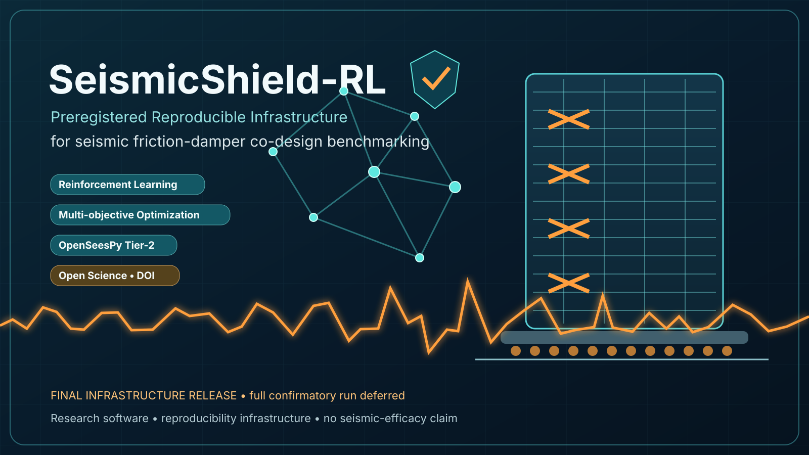

# SeismicShield-RL

**Preregistered, reproducible infrastructure for seismic friction-damper co-design benchmarking**

<p align="center"></p>

<p align="center">
<a href="https://github.com/FaramarzKowsari/seismicshield-rl/actions"></a>
<a href="https://doi.org/10.17605/OSF.IO/64DTX"></a>
<a href="https://doi.org/10.5281/zenodo.22067278"></a>
<a href="https://doi.org/10.5281/zenodo.22067277"></a>
<a href="docs/index.html"></a>
<a href="LICENSE"></a>
</p>

<p align="center"><strong><a href="#english">English</a> · <a href="#türkçe">Türkçe</a> · <a href="#español">Español</a></strong></p>

---

<a id="english"></a>
# English

## About

**SeismicShield-RL** is a preregistered research-software and reproducibility platform for benchmarking reinforcement learning, multi-agent reinforcement learning, and multi-objective optimization in seismic friction-damper co-design. The project separates exploratory software validation, training/validation model selection, and confirmatory evaluation through frozen contracts, immutable scientific source, cryptographic provenance, deterministic execution planning, and leakage-resistant information boundaries.

The project is closed as **SeismicShield-RL v0.8.2 — Final Infrastructure Release**. The infrastructure, preregistration, manifests, source freeze, runtime preflight, execution planner, evidence ledger, and selection-only workspace were completed and preserved. The full Stage-A campaign and the subsequent confirmatory Tier-2 campaign were **not executed** because the measured compute requirement exceeded the intended no-cost execution envelope.

> **No paper-level confirmatory performance result has been generated or inspected. No claim is made that MAPPO, PPO, IPPO, NSGA-II, scalar GA, or random search is superior on the preregistered confirmatory benchmark.**

## Persistent research record

- OSF preregistration DOI: [`10.17605/OSF.IO/64DTX`](https://doi.org/10.17605/OSF.IO/64DTX)
- Zenodo version DOI — exact v0.8.2 release: [`10.5281/zenodo.22067278`](https://doi.org/10.5281/zenodo.22067278)
- Zenodo concept DOI — software across versions: [`10.5281/zenodo.22067277`](https://doi.org/10.5281/zenodo.22067277)
- Immutable scientific tag: `confirmatory-v0.8.2-final`
- Immutable scientific commit: `cecd3b6c27b5deb6cb6be7ddc478cfc407a45644`
- Final technical report: [`paper/TECHNICAL_REPORT_FINAL_INFRASTRUCTURE_RELEASE.md`](paper/TECHNICAL_REPORT_FINAL_INFRASTRUCTURE_RELEASE.md)
- Multilingual landing-page source: [`docs/index.html`](docs/index.html)

## Completed infrastructure

- **34 events × 4 records = 136** explicit-CC ESM records
- Frozen partitions: **52 training / 20 validation / 16 pilot / 48 confirmatory**
- **16 structural states** across 3-, 6-, 10-, and 20-story buildings
- Tier-1 research surrogate and OpenSeesPy Tier-2 backend
- Independent reproduction of all **136 processed-waveform SHA-256 values**
- Successful runtime convergence on **4 Tier-1 + 4 Tier-2 pilot fixtures**
- Deterministic plan: **475 atomic shards / 2,820,160 structural-response calls**
- Selection-only workspace keeping all **51 Tier-2 confirmatory shards locked**
- CI, tests, evidence ledger, audit contracts, and SHA-256 provenance

## Measured computational boundary

| Stage | Atomic shards | Structural-response calls | Projected sequential simulation time |
|---|---:|---:|---:|
| **Stage A Tier-1** | **424** | **2,780,992** | **~1,026.68 h** |
| **Tier-2 confirmatory** | **51** | **39,168** | **~21.64 h** |
| **Grand total** | **475** | **2,820,160** | — |

Runtime preflight measured approximately **1.329 s per Tier-1 call** and **1.989 s per Tier-2 call** on the tested environment. Learned Stage-A shards are scientifically atomic under the frozen implementation; splitting them merely to fit hosted-CI limits would change the preregistered execution semantics.

## Benchmark design

The deferred study asks whether multi-agent reinforcement learning can jointly optimize friction-damper **count**, **inter-story distribution**, and **slip-force level** while improving the out-of-sample Pareto trade-off among retrofit cost, maximum inter-story drift ratio (MIDR), and peak floor acceleration (PFA) under unseen earthquakes and structural uncertainty.

Frozen stochastic methods: **random search · scalar GA · NSGA-II · PPO · IPPO · MAPPO**.

The Final Infrastructure Release **does not answer the ranking question**; it preserves a reproducible way to answer it if suitable compute becomes available later.

## Quick start

```bash
python -m venv .venv
# Windows: .venv\Scripts\activate
# macOS/Linux: source .venv/bin/activate
pip install -e ".[dev,api]"
pytest -q
python scripts/run_smoke_benchmark.py
uvicorn seismicshield_rl.api.app:app --reload
```

## Author

<p align="center"></p>

**Faramarz Kowsari**

Faramarz Kowsari is an author, researcher based in Istanbul. Focusing on the intersection of technology, education, and personal growth, he has published over 80 digital titles on international platforms. His areas of expertise span Artificial Intelligence, prompt engineering, modern trading strategies (Smart Money Concepts & algorithmic trading), as well as classical literature and mindfulness. In addition to writing, he develops web-based educational tools and creates specialized instructional video content.

**Official Profiles & Repositories:**

- Official Website: https://FaramarzKowsari.github.io
- Google Play Books: https://play.google.com/store/search?q=Faramarz%20Kowsari&c=books
- Google Scholar: https://scholar.google.com/citations?user=G7tP5WMAAAAJ&hl=en
- GitHub: https://github.com/FaramarzKowsari
- LinkedIn: https://www.linkedin.com/in/faramarzkowsari
- ORCID: https://orcid.org/0000-0003-1692-0453

---

<a id="türkçe"></a>
# Türkçe

## Proje hakkında

**SeismicShield-RL**, sismik sürtünme sönümleyici ortak tasarımında pekiştirmeli öğrenme, çok-etmenli pekiştirmeli öğrenme ve çok amaçlı optimizasyon yöntemlerini karşılaştırmak için geliştirilmiş, önceden kaydedilmiş ve yeniden üretilebilir bir araştırma yazılımı altyapısıdır. Değişmez bilimsel kaynak, dondurulmuş sözleşmeler, kriptografik köken bilgisi ve deterministik yürütme planlaması kullanır.

Proje **SeismicShield-RL v0.8.2 — Final Infrastructure Release** olarak kapatılmıştır. Altyapı ve çalışma-zamanı doğrulaması tamamlandı; tam Stage-A ve Tier-2 doğrulayıcı kampanyaları hesaplama gereksinimi ücretsiz yürütme hedefini aştığı için **çalıştırılmadı**.

> **Doğrulayıcı performans sonucu üretilmemiş veya incelenmemiştir. Herhangi bir algoritmanın üstün olduğu iddia edilmemektedir.**

### Kalıcı kayıtlar

- OSF ön kayıt DOI: [`10.17605/OSF.IO/64DTX`](https://doi.org/10.17605/OSF.IO/64DTX)
- Zenodo v0.8.2 sürüm DOI: [`10.5281/zenodo.22067278`](https://doi.org/10.5281/zenodo.22067278)
- Zenodo kavram DOI: [`10.5281/zenodo.22067277`](https://doi.org/10.5281/zenodo.22067277)

### Tamamlanan altyapı

- 34 deprem olayı ve 136 ESM kaydı
- 52 eğitim, 20 doğrulama, 16 pilot ve 48 doğrulayıcı kayıt
- 3, 6, 10 ve 20 katlı binalar için 16 yapısal durum
- Tier-1 araştırma modeli ve OpenSeesPy Tier-2 arka ucu
- 136 işlenmiş dalga biçiminin SHA-256 doğrulaması
- 4 Tier-1 ve 4 Tier-2 pilot örneğinde başarılı preflight yakınsaması
- 475 atomik shard ve toplam 2.820.160 yapısal yanıt çağrısı için deterministik plan

Stage A: **2.780.992 Tier-1 çağrısı / ~1.026,68 saat sıralı simülasyon**.  
Tier-2: **39.168 çağrı / ~21,64 saat sıralı simülasyon**.

Bu sürüm gerçek bir binanın güvenliğini onaylamaz ve herhangi bir algoritmanın sismik etkinliğini kanıtlamaz.

## Yazar

<p align="center"></p>

**Faramarz Kowsari**

Faramarz Kowsari, İstanbul merkezli bir yazar ve araştırmacıdır. Teknoloji, eğitim ve kişisel gelişimin kesişimine odaklanarak uluslararası platformlarda 80'den fazla dijital eser yayımlamıştır. Uzmanlık alanları Yapay Zekâ, prompt mühendisliği, modern işlem stratejileri (Smart Money Concepts ve algoritmik işlem) ile klasik edebiyat ve mindfulness alanlarını kapsar. Yazarlığın yanı sıra web tabanlı eğitim araçları geliştirir ve uzmanlaşmış öğretici video içerikleri üretir.

**Resmî Profiller ve Depolar:**

- Resmî Web Sitesi: https://FaramarzKowsari.github.io
- Google Play Books: https://play.google.com/store/search?q=Faramarz%20Kowsari&c=books
- Google Scholar: https://scholar.google.com/citations?user=G7tP5WMAAAAJ&hl=en
- GitHub: https://github.com/FaramarzKowsari
- LinkedIn: https://www.linkedin.com/in/faramarzkowsari
- ORCID: https://orcid.org/0000-0003-1692-0453

---

<a id="español"></a>
# Español

## Acerca del proyecto

**SeismicShield-RL** es una plataforma de software de investigación prerregistrada y reproducible para comparar aprendizaje por refuerzo, aprendizaje por refuerzo multiagente y optimización multiobjetivo en el codiseño sísmico de amortiguadores de fricción. Utiliza código científico inmutable, contratos congelados, procedencia criptográfica y planificación determinista de la ejecución.

El proyecto está cerrado como **SeismicShield-RL v0.8.2 — Final Infrastructure Release**. La infraestructura y la validación de ejecución se completaron; las campañas completas de Stage A y Tier-2 confirmatorio **no se ejecutaron** porque el requisito computacional medido superó el objetivo de ejecución sin coste.

> **No se generó ni inspeccionó ningún resultado confirmatorio de rendimiento. No se afirma la superioridad de ningún algoritmo.**

### Registro persistente

- DOI del prerregistro OSF: [`10.17605/OSF.IO/64DTX`](https://doi.org/10.17605/OSF.IO/64DTX)
- DOI Zenodo de la versión v0.8.2: [`10.5281/zenodo.22067278`](https://doi.org/10.5281/zenodo.22067278)
- DOI conceptual de Zenodo: [`10.5281/zenodo.22067277`](https://doi.org/10.5281/zenodo.22067277)

### Infraestructura completada

- 34 eventos y 136 registros ESM
- 52 registros de entrenamiento, 20 de validación, 16 piloto y 48 confirmatorios
- 16 estados estructurales para edificios de 3, 6, 10 y 20 plantas
- modelo Tier-1 y backend OpenSeesPy Tier-2
- reproducción SHA-256 de los 136 registros procesados
- convergencia de 4 fixtures Tier-1 y 4 Tier-2 durante el preflight
- plan determinista de 475 shards atómicos y 2.820.160 llamadas

Stage A: **2.780.992 llamadas Tier-1 / ~1.026,68 horas secuenciales**.  
Tier-2: **39.168 llamadas / ~21,64 horas secuenciales**.

Esta versión no certifica la seguridad de un edificio ni demuestra eficacia sísmica de ningún algoritmo.

## Autor

<p align="center"></p>

**Faramarz Kowsari**

Faramarz Kowsari es autor e investigador radicado en Estambul. Centrado en la intersección entre tecnología, educación y desarrollo personal, ha publicado más de 80 títulos digitales en plataformas internacionales. Sus áreas de experiencia abarcan Inteligencia Artificial, ingeniería de prompts, estrategias modernas de trading (Smart Money Concepts y trading algorítmico), así como literatura clásica y mindfulness. Además de escribir, desarrolla herramientas educativas basadas en la web y crea contenido audiovisual educativo especializado.

**Perfiles y repositorios oficiales:**

- Sitio web oficial: https://FaramarzKowsari.github.io
- Google Play Books: https://play.google.com/store/search?q=Faramarz%20Kowsari&c=books
- Google Scholar: https://scholar.google.com/citations?user=G7tP5WMAAAAJ&hl=en
- GitHub: https://github.com/FaramarzKowsari
- LinkedIn: https://www.linkedin.com/in/faramarzkowsari
- ORCID: https://orcid.org/0000-0003-1692-0453

---

## Citation / Atıf / Cita

**Zenodo release DOI:** https://doi.org/10.5281/zenodo.22067278  
**Zenodo concept DOI:** https://doi.org/10.5281/zenodo.22067277  
**OSF preregistration:** https://doi.org/10.17605/OSF.IO/64DTX

## License

MIT License. Third-party engines and datasets retain their own licenses and terms. ESM waveform bytes are not redistributed by repository artifacts.
