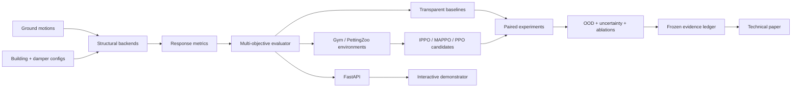

<p align="center">
  
</p>

<h1 align="center">SeismicShield-RL</h1>
<p align="center"><strong>Paper-grade multi-agent reinforcement learning benchmark for seismic damper co-design</strong></p>
<p align="center">
  
  
  
  
</p>

> **Scientific status — frozen confirmatory source v0.8.2:** the public protocol is registered at OSF as DOI [`10.17605/OSF.IO/64DTX`](https://doi.org/10.17605/OSF.IO/64DTX). The explicit-CC 136-record ESM manifest, structural-world manifest, numerical freeze, algorithm bundle, execution contract and analysis contract are frozen and validation-backed. The immutable scientific source is Git tag `confirmatory-v0.8.2-final`. No paper-level confirmatory performance result is available yet.

> **Confirmatory status:** **THE CONFIRMATORY GATE IS OPEN AT THE IMMUTABLE v0.8.2 SOURCE TAG, BUT CONFIRMATORY STRUCTURAL-RESPONSE RESULTS HAVE NOT YET BEEN GENERATED OR INSPECTED.** The current post-freeze step is a pilot-only runtime preflight that verifies exact frozen data hashes plus Tier-1/Tier-2 runtime behavior without evaluating the confirmatory partition.

The algorithm seeds, bootstrap seed, manifests, objectives, validation-selection rules and inferential procedures are frozen. Scientific execution must refuse to proceed unless `scripts/check_confirmatory_gate.py` returns `PASS` at `confirmatory-v0.8.2-final`. Post-freeze orchestration utilities may transport and hash-check data, but they cannot change the scientific code or contracts resolved by that tag.


## Open-science commitment

The project uses an explicit preregistration-first confirmatory workflow. The existing v0.1 synthetic smoke benchmark is disclosed as prior exploratory software validation. The public OSF registration is now fixed at DOI [`10.17605/OSF.IO/64DTX`](https://doi.org/10.17605/OSF.IO/64DTX), and confirmatory execution is permitted only from the immutable scientific tag after the programmatic gate passes. See [`open_science/confirmatory_gate_v0.8.0.yaml`](open_science/confirmatory_gate_v0.8.0.yaml), [`open_science/confirmatory_execution_v0.8.2.yaml`](open_science/confirmatory_execution_v0.8.2.yaml), [`open_science/confirmatory_analysis_v0.8.2.yaml`](open_science/confirmatory_analysis_v0.8.2.yaml), [`open_science/CONFIRMATORY_RUNTIME_RUNBOOK_v0.8.2.md`](open_science/CONFIRMATORY_RUNTIME_RUNBOOK_v0.8.2.md) and [`SIMULATOR_STACK.md`](SIMULATOR_STACK.md).

Persistent identifiers are deliberately separated by scholarly object: the OSF DOI identifies the preregistered protocol; a later Zenodo concept/version DOI will identify frozen software/evidence releases; and a manuscript preprint DOI will identify the paper. The OSF DOI is not presented as a software DOI.

## Research question

Can a multi-agent reinforcement-learning co-design policy jointly optimize the **number**, **inter-story distribution**, and **slip-force parameters** of friction dampers in multi-story buildings while producing a better out-of-sample Pareto trade-off among **retrofit cost**, **maximum inter-story drift ratio (MIDR)**, and **peak floor acceleration (PFA)** than transparent heuristic, evolutionary, and single-agent RL baselines under unseen earthquake records and structural uncertainty?

## Why this repository exists

Seismic-control RL papers are often difficult to compare because the structural model, earthquake split, reward normalization, optimizer budget, seeds, and evaluation protocol vary together. SeismicShield-RL is designed as a **benchmark first and a model second**: every algorithm must solve the same frozen tasks, on the same earthquake worlds, with the same compute budget and the same reporting contract.

The project is organized around two tracks:

- **Track A — Core research:** structural dynamics, OpenSees parity, benchmark tasks, baselines, MARL algorithms, experiments, ablations, uncertainty, frozen evidence and manuscript claims.
- **Track B — Research demonstrator:** interactive simulator, scenario explorer, REST API and GitHub Pages. Demonstrator outputs are never the source of primary paper claims.

## Primary benchmark tasks

### Task A — Offline structural co-design (primary paper)
One episode represents one retrofit design. Each story is an agent. Agents simultaneously choose damper count and slip-force level. A shared global objective evaluates cost, MIDR and PFA over a frozen suite of ground motions. This formulation tests decentralized design decisions with centralized training/evaluation.

### Task B — Adaptive semi-active control (extension)
At each structural time step, story-level agents adjust admissible slip-force commands. This task will be added only after the passive/offline benchmark and OpenSees backend pass parity tests, so design optimization and real-time control are not conflated.

## Core platform and frozen confirmatory infrastructure

- deterministic N-story shear-building research surrogate
- smooth Coulomb-style story damper model for fast algorithm development
- MIDR, PFA and dissipated-energy metrics
- explicit damper-count/capacity cost model
- no-damper, uniform, drift-proportional and random-search baselines
- scalar GA, NSGA-II, PPO, IPPO and MAPPO confirmatory execution implementations
- one-shot single-agent Gymnasium-compatible design environment (optional dependency)
- PettingZoo Parallel multi-agent design environment (optional dependency)
- OpenSeesPy Tier-2 backend with frozen validation contract and CI evidence
- reproducible synthetic ground-motion fixture for software validation
- frozen explicit-CC ESM manifest with 34 events × 4 records = 136 records
- frozen structural-world manifest and seed ledger
- validation-safe candidate/checkpoint selection and leakage-resistant information boundary
- immutable `confirmatory-v0.8.2-final` source tag and fail-closed gate
- pilot-only runtime preflight and non-waveform evidence artifacts
- paired benchmark runner with CSV/JSON artifacts and SHA-256 manifest
- FastAPI endpoints for simulation and benchmark execution
- Docker image
- GitHub Actions CI, smoke benchmark and GitHub Pages workflows
- research contract, evidence ledger, manuscript outline and roadmap

## Architecture



## Repository map

```text
configs/                    Building and experiment contracts
data/                       Data policy + synthetic test fixture
docs/                       GitHub Pages research presentation
paper/                      Manuscript outline + evidence ledger
results/                    Generated benchmark evidence
scripts/                    Reproducible entry points
src/seismicshield_rl/       Research package
tests/                      Unit and contract tests
.github/workflows/          CI, smoke benchmark and Pages
```

## Quick start

```bash
python -m venv .venv
# Windows: .venv\Scripts\activate
# macOS/Linux: source .venv/bin/activate
pip install -e ".[dev,api]"
pytest -q
python scripts/run_smoke_benchmark.py
uvicorn seismicshield_rl.api.app:app --reload
```

Open `http://127.0.0.1:8000/docs` for the interactive REST API.

### Optional MARL stack

```bash
pip install -e ".[marl]"
```

The environment contract uses simultaneous story actions and is therefore represented with the PettingZoo Parallel API. The frozen v0.8.2 confirmatory implementations are subject to the registered equal-budget, seed, validation-selection and information-boundary contracts; changes after the immutable tag cannot silently become part of the confirmatory analysis.

### Optional OpenSeesPy backend

OpenSeesPy is intentionally optional for ordinary development. The current frozen Tier-2 validation/runtime path uses Python 3.12. Install the optional backend in a Python 3.12 environment:

```bash
pip install -e ".[opensees]"
```

`src/seismicshield_rl/physics/opensees_backend.py` is the Tier-2 structural backend used by the frozen confirmatory contract after its validation gate passes. The pilot runtime preflight checks availability and convergence before any confirmatory response run. This validation does not certify a real building or convert benchmark outputs into engineering approval.

## Evidence policy

A statement may enter the paper/results section only if it has all of the following:

1. a frozen experiment configuration;
2. source commit SHA and environment metadata;
3. preserved raw and derived artifacts;
4. deterministic seed ledger;
5. SHA-256 checksums;
6. a statistical analysis record;
7. a row in `paper/EVIDENCE_LEDGER.csv` marked `verified`.

README figures and the public demonstrator can summarize frozen evidence, but they cannot create evidence.

## Planned algorithm ladder

1. no damper
2. uniform allocation
3. drift-proportional heuristic
4. random search
5. scalar GA
6. NSGA-II / evolutionary multi-objective baseline
7. single-agent PPO
8. IPPO with parameter sharing
9. MAPPO / centralized critic

For the frozen confirmatory experiment, algorithm identities, budgets, seeds and selection rules are fixed by the registered contracts. A learned method is not considered useful merely because its training return rises; it must be judged on the prespecified held-out/confirmatory comparisons and inferential analysis.

## Primary metrics

- retrofit cost proxy: damper count + normalized force capacity
- maximum inter-story drift ratio (MIDR)
- peak floor acceleration (PFA)
- dissipated damper energy
- solver/non-convergence rate
- Pareto hypervolume for multi-objective experiments
- out-of-distribution degradation
- prespecified event-level effect sizes, intervals and multiplicity-adjusted tests

## Scope and safety

This repository is a research and reproducibility platform. It does not certify a building, prescribe retrofit work, predict an earthquake, replace a structural engineer, or provide code-compliance approval. Any real-building conclusion requires validated nonlinear structural models, authoritative records, calibration, engineering review and an explicit code/standards context. Passing software, backend or pilot-runtime gates is evidence of reproducibility/infrastructure readiness, not proof of field performance.

## Author

**Faramarz Kowsari** — author, Software Engineer and AI researcher based in Istanbul.

- ORCID: https://orcid.org/0000-0003-1692-0453
- GitHub: https://github.com/FaramarzKowsari
- Project site: `https://faramarzkowsari.github.io/seismicshield-rl/`

## Citation

The confirmatory protocol is publicly preregistered at OSF DOI [`10.17605/OSF.IO/64DTX`](https://doi.org/10.17605/OSF.IO/64DTX), and the immutable scientific source is `confirmatory-v0.8.2-final`. A Zenodo software/evidence DOI has not yet been asserted in this README. Until a software release DOI is minted, use `CITATION.cff` for repository authorship metadata and cite the OSF DOI specifically as the preregistered protocol rather than as the software DOI.

## License

Project code is MIT licensed. Optional third-party structural engines and datasets retain their own licenses and terms. In particular, OpenSeesPy has separate terms for commercial redistribution; consult its official documentation before packaging it into a commercial application or hosted service. ESM record metadata and access references are preserved with source/license provenance; waveform redistribution follows the source terms and is not performed by repository artifacts.

## Research design documents

- [`LITERATURE_AND_NOVELTY.md`](LITERATURE_AND_NOVELTY.md) — direct literature map and novelty boundary
- [`PROPOSED_MODEL.md`](PROPOSED_MODEL.md) — SeismicShield-MAPPO architecture and required ablations
- [`EXPERIMENT_PROTOCOL.md`](EXPERIMENT_PROTOCOL.md) — equal-budget, paired and confirmatory experiment protocol
- [`RESEARCH_CONTRACT.md`](RESEARCH_CONTRACT.md) — claim and release discipline
