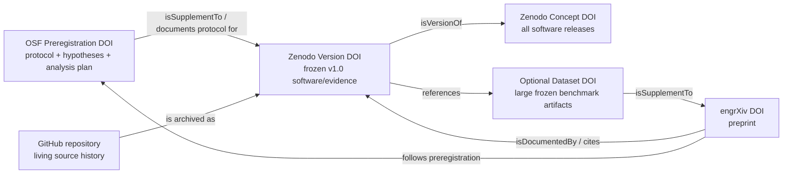

# DOI and scholarly-object relationship graph

SeismicShield-RL deliberately uses separate persistent identifiers for separate objects.

## Intended citation roles

- **OSF DOI:** cite the preregistered protocol and confirmatory commitments.
- **Zenodo version DOI:** cite the exact frozen software/evidence release used for the paper.
- **Zenodo concept DOI:** cite the evolving software project across releases.
- **engrXiv DOI:** cite the manuscript/preprint.
- **Dataset DOI (if created):** cite a separately frozen benchmark/evidence dataset.

The identifiers will be cross-linked through OSF metadata, Zenodo `related_identifiers`, `CITATION.cff`, the preprint references/data availability statement and GitHub README badges.
